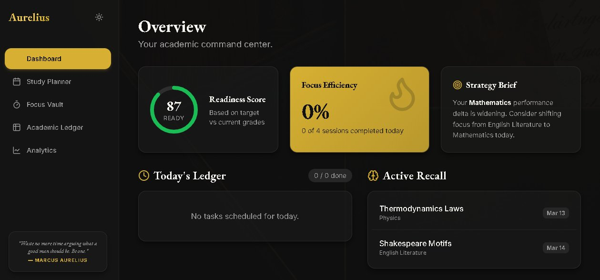
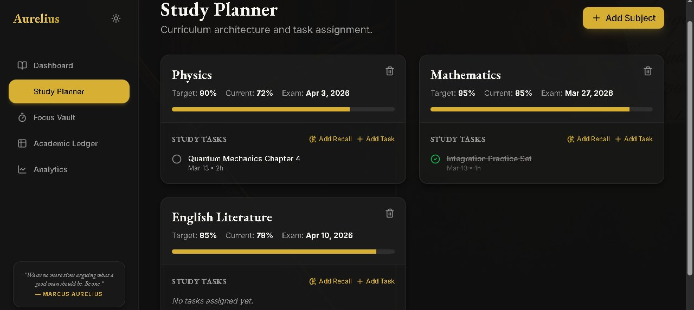
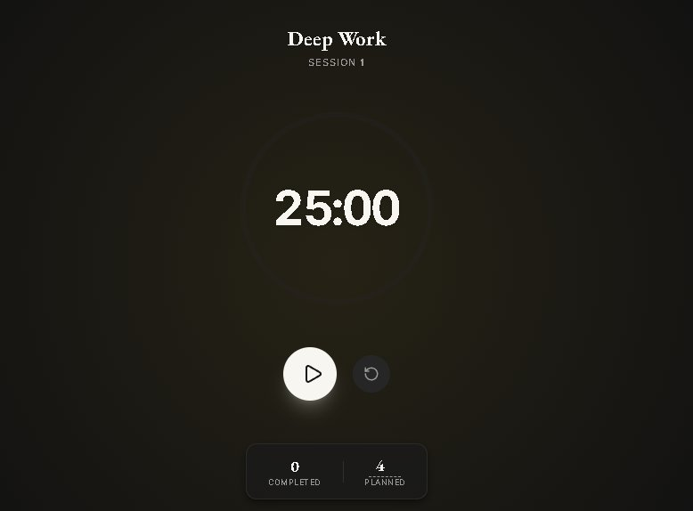
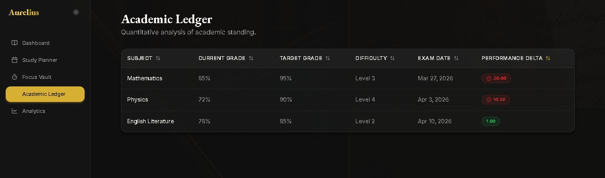
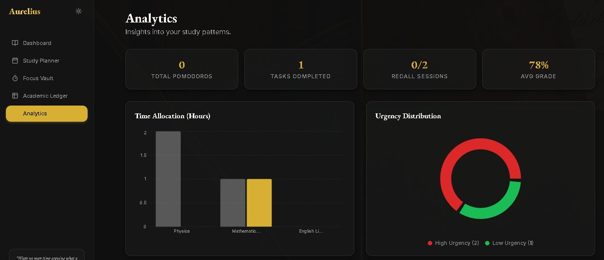

# Aurelius Study Suite

> A luxury-grade intelligent planning system for elite academic performance.

---

## Screenshots

### Dashboard — Strategic Overview


### Study Planner — Curriculum Architecture


### Zen Focus Vault — Deep Work Timer


### Academic Ledger — Quantitative Analysis


### Analytics — Study Pattern Insights


---

## Overview

Aurelius Study Suite is a premium academic productivity platform built for students who want more than a to-do list. It combines cognitive science — spaced repetition, performance gap analysis, and focus efficiency tracking — into a single, elegant workspace. The interface follows the **Library Luxe** design system: cream and racing green in light mode, midnight charcoal and brushed gold in dark mode, with glassmorphism cards and smooth 300ms theme transitions throughout.

---

## Features

### Strategic Dashboard
A high-level command centre showing your academic readiness at a glance. Includes a radial readiness-score gauge, a subject priority heatmap, today's tasks, upcoming recall sessions, and a focus efficiency stat. An **AI Strategy Brief** generates a two-sentence recommendation based on whichever subject has the widest performance gap — no API key required, pure rule-based logic.

### Study Plan Generator
Input a subject name, current grade, target grade, difficulty rating (1–5), exam date, and daily study hours. The planner generates a structured task schedule and automatically queues spaced repetition recall sessions the moment a topic is marked complete.

### Spaced Repetition Engine
Built on a simplified forgetting curve. When a topic is completed, recall sessions are scheduled at **+1 day**, **+7 days**, and **+30 days** and surfaced in a chronological timeline, so nothing falls through the cracks before exam day.

### GPA Gap Analyzer
Calculates a **Performance Delta** for every subject:

```
Performance Delta = (Target Grade − Current Grade) × Difficulty ÷ Days Until Exam
```

Higher deltas surface first in an urgency ranking, so you always know where an hour of study has the most leverage.

### Zen Focus Vault
A full-screen Pomodoro mode with an analog-style 25-minute countdown. Navigation collapses entirely so nothing competes for your attention. Tracks completed vs. planned Pomodoros to compute your **Focus Efficiency** percentage.

### Academic Ledger
A sortable table of every subject — current grade, target grade, difficulty, days to exam, performance delta, and urgency rank — giving a spreadsheet-style audit trail of where you stand.

### Study Analytics
Visual charts for planned hours, completed sessions, upcoming recall sessions, and subject urgency distribution.

---

## Tech Stack

| Layer | Choice |
|---|---|
| Framework | Next.js 14 (App Router) |
| Styling | Tailwind CSS |
| Icons | Lucide Icons |
| Fonts | EB Garamond (headings) · Inter (UI) |
| State | React Context API |
| Persistence | `localStorage` via `useEffect` |
| Deployment | Vercel (zero config) |

No backend. No database. No API keys. Everything runs in the browser.

---

## Getting Started

```bash
git clone https://github.com/Prathamesh8989/aurelius-study-suite
cd aurelius-study-suite
npm install
npm run dev
```

Open [http://localhost:3000](http://localhost:3000).

To deploy, push to GitHub and import the repository on [vercel.com](https://vercel.com) — no extra configuration needed.

---

## Project Structure

```
/app
├── page.js                  # Dashboard
├── planner/page.js          # Study Plan Generator
├── focus/page.js            # Zen Focus Vault (Pomodoro)
├── ledger/page.js           # Academic Ledger
└── analytics/page.js        # Study Analytics

/components
├── Sidebar.js
├── Header.js
├── StatCard.js
├── PomodoroTimer.js
├── Heatmap.js
└── RadialGauge.js

/context
└── StudyContext.js          # Global state + localStorage sync

/styles
└── globals.css

/screenshots
├── screenshot-dashboard.png
├── screenshot-planner.png
├── screenshot-focus.png
├── screenshot-ledger.png
└── screenshot-analytics.png
```

---

## Design System — Library Luxe

| Token | Light Mode | Dark Mode |
|---|---|---|
| Background | `#fdfbf7` Cream | `#121212` Midnight Charcoal |
| Text | `#064e3b` Racing Green | `#f8f6f2` Soft Ivory |
| Accent | `#d4af37` Brushed Gold | `#d4af37` Gold Glow |

Cards use `backdrop-filter: blur(20px)` with 0.5px borders and soft shadows. Theme transitions interpolate over 300ms.

---

## Algorithms

### Spaced Repetition
```js
/**
 * Schedules recall sessions on a simplified forgetting curve.
 * Intervals: +1 day, +7 days, +30 days from completion date.
 * @param {Date} completedAt - The date the topic was marked done.
 * @returns {Date[]} Array of three recall session dates.
 */
```

### Performance Delta
```js
/**
 * Measures urgency of grade improvement for a given subject.
 * Formula: (targetGrade - currentGrade) * difficulty / daysUntilExam
 * Higher delta = higher priority in the urgency ranking.
 * @param {number} current    - Current grade percentage.
 * @param {number} target     - Target grade percentage.
 * @param {number} difficulty - Subject difficulty on a 1–5 scale.
 * @param {number} days       - Days remaining until the exam.
 * @returns {number} Performance delta score.
 */
```

### Focus Efficiency
```js
/**
 * Ratio of completed to planned Pomodoro sessions.
 * Focus Efficiency = completedPomodoros / plannedPomodoros
 * Displayed as a percentage on the dashboard.
 */
```

---
